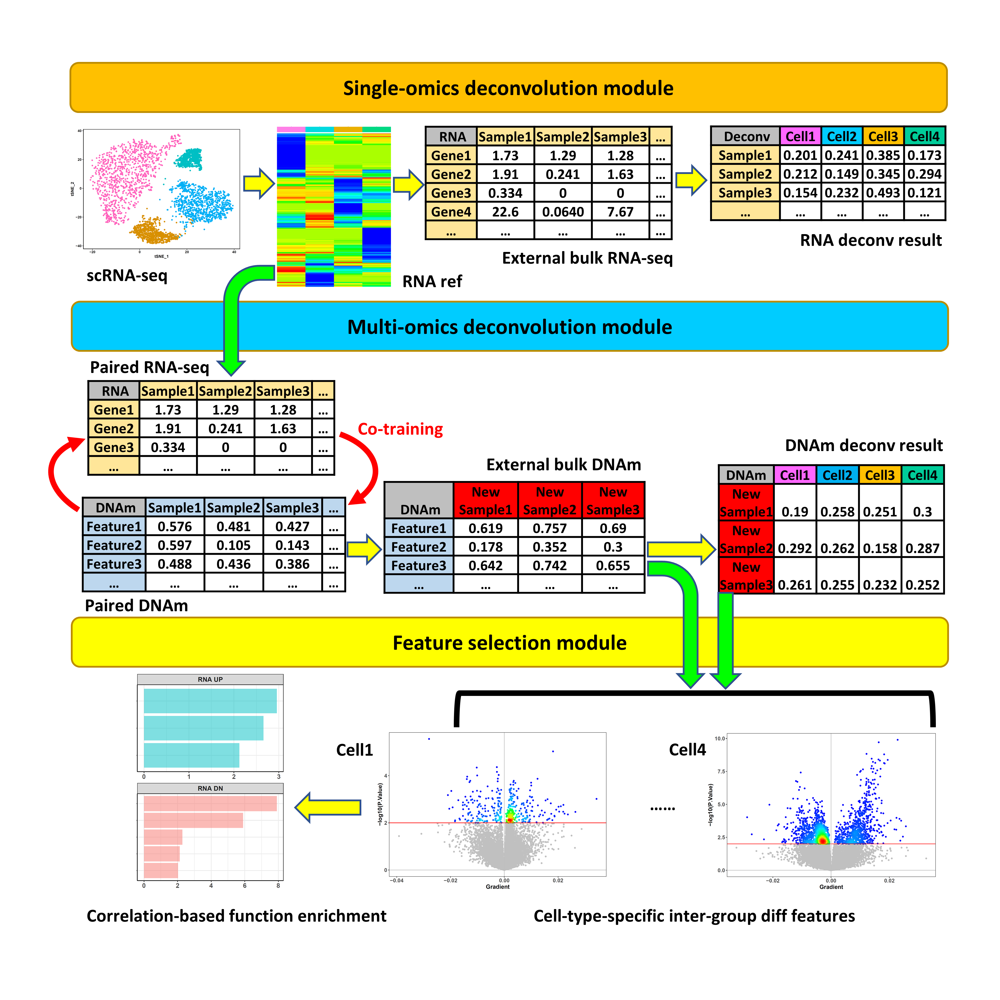
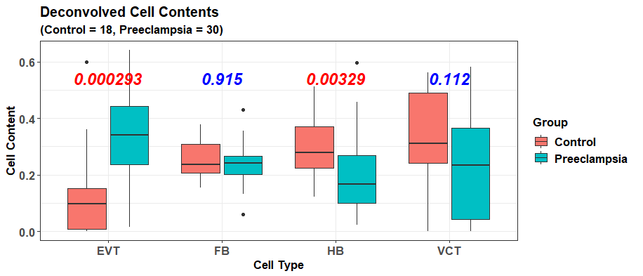
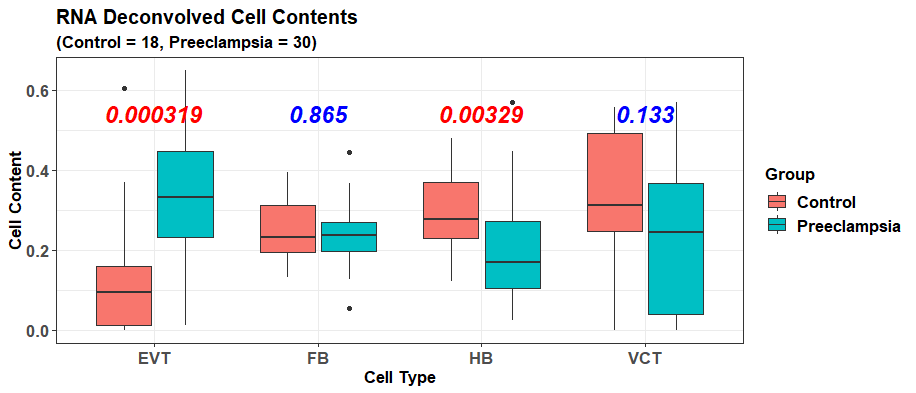
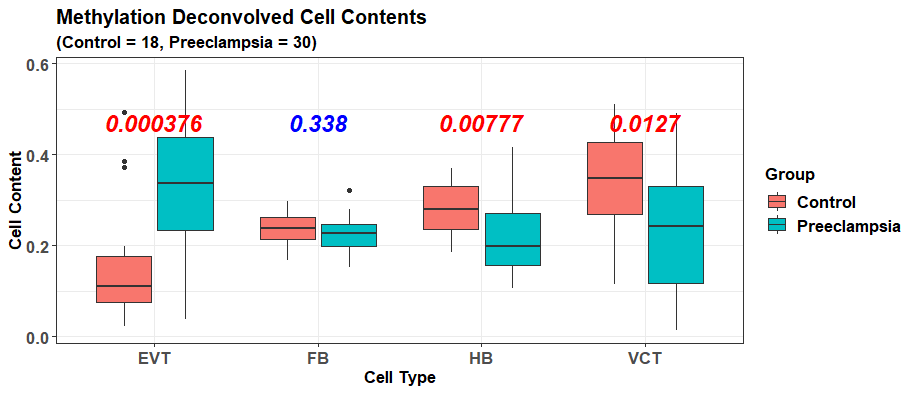
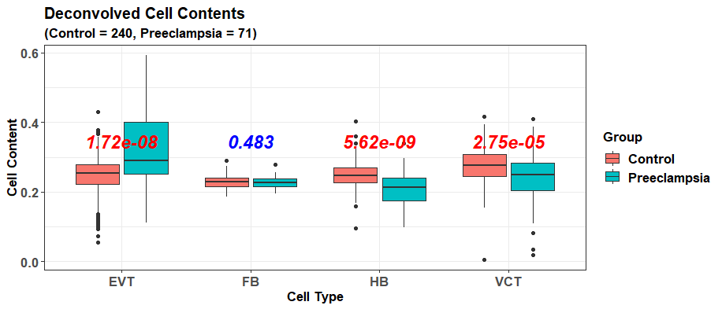
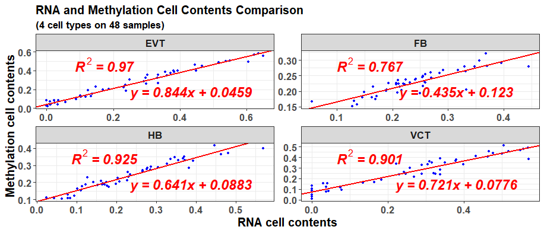

```{r, echo=FALSE, results='hide', include = FALSE}
knitr::opts_chunk$set(
  collapse = TRUE,
  comment = "#>", 
  warning = FALSE, 
  message = FALSE, 
  fig.width = 8, 
  fig.height = 8, 
  size = "Large"
)
```


## Introduction

Many DNA methylation (DNAm) data are from tissues composed of various cell types; hence, cell deconvolution methods are needed to infer their cell compositions accurately. However, a bottleneck for DNAm data is the lack of cell-type-specific DNAm references. On the other hand, scRNA-seq data are being accumulated rapidly with various cell type transcriptomic signatures characterized, and also, many paired bulk RNA-DNAm data are publicly available currently. Hence, I developed the R package *scDeconv* to use these resources to solve the reference deficiency problem of DNAm data and deconvolve them from scRNA-seq data in a trans-omics manner. 

It assumes that paired samples have similar cell compositions. So the cell content information deconvolved from the scRNA-seq and paired RNA data can be transferred to the paired DNAm samples. Then an ensemble model is trained to fit these cell contents with DNAm features and adjust the paired RNA deconvolution in a co-training manner. Finally, the model can be used on other bulk DNAm data to predict their relative cell type abundances. If given an appropriate paired dataset, *scDeconv* can also deconvolve other omics, such as ATAC-seq data. Furthermore, the package also contains other functions, such as identifying cell-type-specific inter-group differential features from bulk DNAm data.

## Package overview

The package has three modules. The first is a single-omics deconvolution module. Its function `scRef` can construct cell transcriptomic references from scRNA-seq data. Next, the reference is transferred to the function `refDeconv`. It performs a recursion process to solve a constrained linear model to deconvolve bulk RNA data with the RNA reference. 

The second module is a multi-omics deconvolution module. Its function `epDeconv` deconvolves bulk DNAm microarray data via an RNA reference. It also needs another dataset with paired RNA-DNAm data. Because of the pairing, I assume the cell contents of the RNA and DNAm samples are similar. Hence, the deconvolution results from the RNA reference and RNA samples can be shared with the paired DNAm samples to train a cell contents prediction model with DNAm features.

The third module is a feature selection module. It accepts the deconvolution results from the former modules. Then, it uses them to identify cell-type-specific inter-group differential features from the bulk data.



## Citation

Liu Y. [*scDeconv*: an R package to deconvolve bulk DNA methylation data with scRNA-seq data and paired bulk RNA-DNA methylation data.](https://academic.oup.com/bib/article-abstract/23/3/bbac150/6572659?redirectedFrom=fulltext) *Brief Bioinform*. 2022 May 13;23(3):bbac150. doi: 10.1093/bib/bbac150. PMID: 35453146; PMCID: PMC9271220.

## Installation

The code of *scDeconv* is freely available at <https://github.com/yuabrahamliu/scDeconv>.

The following commands can be used to install this R package via GitHub. 

<style>
div.colorCode pre { background-color:#F7F7F7; }
</style>

<div class = "colorCode">
```
library(devtools)

install_github('yuabrahamliu/scDeconv')
```
</div>

It can also be installed via Bioconductor. 

<style>
div.colorCode pre { background-color:#F7F7F7; }
</style>

<div class = "colorCode">
```
if (!require("BiocManager", quietly = TRUE))
    install.packages("BiocManager")
    
# The following initializes usage of Bioc devel
BiocManager::install(version = 'devel')

BiocManager::install("scDeconv")
```
</div>

## Data preparation

We will use the data that accompany with *scDeconv* package in this tutorial. They contain a *Seurat* object generated from scRNA-seq data and preprocessed by the R package *Seurat*. It is a subset of a human placenta scRNA-seq dataset in ArrayExpress, with experiment code E-MTAB-6701 (droplet-based data), and covers 1388 cells and 21737 genes. We will deconvolve 4 main placental cell types in it, including extravillous trophoblasts (EVTs), fibroblasts (FBs), Hofbauer cells (HBs), and villous cytotrophoblasts (VCTs). Among them, EVT and VCT are epithelial trophoblasts with similar origins, while HB cells are fetal macrophages in the placenta. The cell type information is contained in the metadata of the *Seurat* object. In addition, this *Seurat* object also has the gene read count data and normalized data. We will use it to generate an RNA deconvolution reference via *scDeconv*.

On the other hand, the data that need to be deconvolved are bulk DNAm data with 311 human placenta samples and 18626 probes. They are collected from 9 different GEO datasets based on the platforms of Illumina 27K and 450K and have gone through preprocessing with batch difference adjusted and the shared high-quality probes retained.

To deconvolve these DNAm data with the scRNA-seq data, *scDeconv* also needs a paired bulk RNA-bulk DNAm dataset to fulfill the trans-omics deconvolution, which is also in the accompanying data, with 48 human placenta samples. Its RNA part contains 22188 genes, and its DNAm part contains 18626 probes, the same as the ones in the DNAm data to be deconvolved. Because batch difference exists between the paired DNAm data and the ones to be deconvolved, they have been adjusted with the `ComBat` function in the R package *sva*, using the paired DNAm set as the reference batch.

The paired RNA data are from the platform Affymetrix Human Gene 1.0 ST Array, and the gene expression values are library size normalized values with log2 transformation. In contrast, that in the DNAm datasets are beta values. The samples in both the paired dataset and the external DNAm dataset to be deconvolved can be divided into 2 groups. One is the normal sample group, and the other is the disease group with a preeclampsia pregnancy complication. This information and the original GEO datasets of the samples can be found in the metadata frame coupled with this package.

Now, attach *scDeconv* to the R session and take a look at these data.

```{r, results='hide'}
library(scDeconv)

scRNA <- system.file('extdata', 'scRNAseqdat.rds', package = 'scDeconv')
scRNA <- readRDS(scRNA)

pRNA <- system.file('extdata', 'pairedRNAdat.rds', package = 'scDeconv')
pRNA <- readRDS(pRNA)

pDNAm <- system.file('extdata', 'pairedDNAmdat.rds', package = 'scDeconv')
pDNAm <- readRDS(pDNAm)

externalDNAm <- system.file('extdata', 'externalDNAmdat.rds', package = 'scDeconv')
externalDNAm <- readRDS(externalDNAm)

DNAmpd <- system.file('extdata', 'DNAmpd.rds', package = 'scDeconv')
DNAmpd <- readRDS(DNAmpd)
```

The summary or beginning parts of these data are shown below.

```{r}
#The scRNA-seq data
scRNA

head(scRNA@meta.data)
```

```{r}
#The paired RNA microarray data
pRNA[1:6,1:6]
```

```{r}
#The paired DNAm data
pDNAm[1:6,1:6]
```

```{r}
#The external DNAm data to be deconvolved
externalDNAm[1:6,1:6]
```

```{r}
#The metadata for the paired samples
head(subset(DNAmpd, type == 'paired'))

table(subset(DNAmpd, type == 'paired')$Samplegroup)

#The metadata for the external samples to be deconvolved
head(subset(DNAmpd, type == 'external'))

table(subset(DNAmpd, type == 'external')$Samplegroup)
```

## RNA reference generation and bulk RNA data deconvolution

We will first use the scRNA-seq and paired RNA data to construct an RNA deconvolution reference. It can be achieved via the function `scRef` in the package.

We provide the scRNA-seq data to `scRef` via its parameter `Seuratobj` and set another parameter `targetcelltypes` as `c('EVT', 'FB', 'HB', 'VCT')`, meaning these 4 cell types in the scRNA-seq data will be covered to generate the reference. The parameter `celltypecolname` is set as “annotation”, indicating that the cell type information for every single cell is stored in the column “annotation” of the scRNA-seq metadata frame.

Because the first step of reference making is to synthesize several pseudo-bulk RNA-seq samples for each cell type from the scRNA-seq data, the parameter `pseudobulknum` is used to set how many such samples will be made for each cell type, and we set it as 100 here, meaning each cell type will get 100 pseudo-bulk RNA samples via sampling from the scRNA-seq data, and the 4 cell types will totally get 100*4 = 400 such samples.

It should be noted that for large scRNA-seq data, this pseudo-bulk sample synthesis step of `scRef` can be very slow. In this case, I suggest using another function, `prepseudobulk`, in the package to conduct this step first. Then save the output and transfer it to `scRef` via its parameter `pseudobulkdat` to construct the reference. It is because the same scRNA-seq data may be needed to deconvolve various bulk RNA or DNAm datasets, so saving the pseudo-bulk samples can avoid repeating their synthesis for different deconvolution tasks.

Then, the synthesized samples will go through several steps to get the final reference, while if the bulk RNA data need to be deconvolved (the paired RNA data `pRNA` here) is provided to the parameter `targetdat`, a batch adjustment step will be included to remove the batch difference or platform difference between the scRNA-seq and the bulk RNA data. If no data is provided to it, this step will be skipped. Because the values in `pRNA` are log2 transformed values, we set the parameter `targetlogged` as TRUE.

```{r, results='hide'}
#Generate the reference with scRef directly 
#refres <- scRef(Seuratobj = scRNA, 
#                targetcelltypes = c('EVT', 'FB', 'HB', 'VCT'),  
#                celltypecolname = 'annotation',  
#                pseudobulknum = 100, 
#                targetdat = pRNA, 
#                targetlogged = TRUE)

#Or use the function prepseudobulk to synthesize the pseudo-bulk data first, 
#and then transfer the pseudo-bulk data to scRef to generate the reference, 
#which is more suggested                                                           
pseudobulk <- prepseudobulk(Seuratobj = scRNA, 
                            targetcelltypes = c('EVT', 'FB', 'HB', 'VCT'), 
                            celltypecolname = 'annotation', 
                            pseudobulknum = 100)

refres <- scRef(Seuratobj = scRNA,  
                targetcelltypes = c('EVT', 'FB', 'HB', 'VCT'),  
                celltypecolname = 'annotation',  
                pseudobulkdat = pseudobulk, 
                targetdat = pRNA, 
                targetlogged = TRUE)

#Save the synthesized pseudo-bulk dataset so that it can be used repetitively 
#for different tasks
#saveRDS(pseudobulk, 'pseudobulk.rds')
```

The result `refres` is a list containing 2 slots. The one named “ref” is the RNA reference generated.

```{r}
head(refres$ref)
```

The other slot named “targetnolog” is the adjusted bulk RNA data to be deconvolved, and the values in it are non-log transformed values.

```{r}
refres$targetnolog[1:6,1:6]
```

After getting the RNA reference and the adjusted bulk RNA data, they can be transferred to the function `refDeconv` in the package to deconvolve the bulk RNA data with the RNA reference. The obtained RNA reference `refres$ref` and the adjusted bulk RNA data `refres$targetnolog` can be transferred to the parameters `ref` and `targetdat`, and because the values of `refres$targetnolog` are non-log transformed, the parameter `targetlogged` is set as FALSE. Another parameter `rescale` can be set as TRUE so that the sum of all the deconvolved cell contents for each sample will be 1.

```{r, results='hide', fig.show='hide'}
rnares <- refDeconv(ref = refres$ref, 
                    targetdat = refres$targetnolog, 
                    targetlogged = FALSE, 
                    resscale = TRUE, 
                    plot = TRUE, 
                    pddat = subset(DNAmpd, type == 'paired'))
```



```{r}
#Result for the bulk RNA microarray data
head(rnares)
```

It is noteworthy that the result of `refDeconv` is very accurate and outperforms all other popular RNA deconvolution algorithms. The details can be found in my original publication for *scDeconv* (Liu Y. [*scDeconv*: an R package to deconvolve bulk DNA methylation data with scRNA-seq data and paired bulk RNA-DNA methylation data.](https://academic.oup.com/bib/article-abstract/23/3/bbac150/6572659?redirectedFrom=fulltext) *Brief Bioinform*. 2022 May 13;23(3):bbac150. doi: 10.1093/bib/bbac150. PMID: 35453146; PMCID: PMC9271220).

## Bulk DNAm data deconvolution with RNA reference

After getting the RNA reference, we use it to deconvolve the external DNAm data `externalDNAm` via the function `epDeconv`. It also needs the paired bulk RNA-bulk DNAm dataset, and for the RNA part, it is the adjusted bulk RNA data returned by `scRef`, and we provide it to the parameter `rnamat`, while for the DNAm part, we provide the data `pDNAm` to `methylmat`. Because the values in the adjusted RNA data are non-log transformed values, we set the parameter `rnamatlogged` as FALSE.

To deconvolve `externalDNAm` with the RNA reference `refres$ref`, `epDeconv` will construct an ensemble model on the paired RNA and DNAm data in a co-training manner and then use this model to predict the cell contents for `externalDNAm`. For the number of base learners of the ensemble, it is defined by the parameter `learnernum`, and we set it as 10 here. While because we want the 4 cell contents deconvolved can have a sum of 1 for each DNAm sample, we set the parameter `resscale` as TRUE.

If we want box plots to show the deconvolution results for the paired RNA, paired DNAm, and external DNAm data, we can set the parameter `plot` as TRUE. At the same time, we can provide the metadata frame of the paired samples to `pddat`, and that of the external samples to `targetmethylpddat`, so that the sample group information can be transferred to the function, and the cell content difference can also be shown in the plot.

```{r, results='hide', fig.show='hide'}
dnamres <- epDeconv(rnaref = refres$ref, 
                    rnamat = refres$targetnolog, 
                    rnamatlogged = FALSE, 
                    
                    methylmat = pDNAm, 
                    learnernum = 10, 
                    resscale = TRUE, 
                    
                    targetmethyldat = externalDNAm, 
                    plot = TRUE, 
                    pddat = subset(DNAmpd, type == 'paired'), 
                    targetmethylpddat = subset(DNAmpd, type == 'external'))
```







From the box plots, we can see that in all the 3 datasets, preeclampsia samples have a much higher EVT cell content than normal samples, while their HB and VCT cells are largely reduced.

In addition, 4 scatter plots are also generated for the cell types as `plot` is set as TRUE, and they compare the deconvolution results between the paired RNA data and the paired DNAm data. Because `epDeconv` constructs the model based on the assumption that paired samples have similar cell compositions, the results predicted by it should show a high correlation between the RNA and DNAm data.



The concrete values of the deconvolution results can be seen from the result `dnamres`. Its slots "rnacellconts" and "methylcellconts" contain the results for the paired data, while the slot "methyltargetcellconts" contains the results for the external DNAm data.

```{r}
#Result for the paired RNA microarray data
head(dnamres$rnacellconts)
```

```{r}
#Result for the paired DNAm data
head(dnamres$methylcellconts)
```

```{r}
#Result for the external DNAm data
head(dnamres$methyltargetcellcounts)
```

The trained ensemble model is also in `dnamres`; its slot “modellist” is the base learners of the model, while “normweights” is the base learner weights for the ensemble.

If `externalDNAm` is not provided to `epDeconv`, it will not influence the ensemble model training on the paired data, and the same model can still be returned. Then, `externalDNAm` can be transferred with the `epDeconv` result to the function `methylpredict` to predict the external sample cell contents.

```{r}
externalcellconts <- methylpredict(model = dnamres, 
                                   targetmethyldat = externalDNAm, 
                                   resscale = TRUE, 
                                   adjustminus = TRUE)

head(externalcellconts)
```

In addition, *scDeconv* also contains other useful functions such as `celldiff`, which selects cell-type-specific inter-group differential features from bulk data; and `enrichwrapper`, which annotates differential DNAm feature function using a correlation-based method. To make this tutorial simple and clear, they will not be covered here, but the users can explore them via the help documents and the original publication for this package. 

My original publication on *scDeconv* contains more examples of its functions and is recommended to read (Liu Y. [*scDeconv*: an R package to deconvolve bulk DNA methylation data with scRNA-seq data and paired bulk RNA-DNA methylation data.](https://academic.oup.com/bib/article-abstract/23/3/bbac150/6572659?redirectedFrom=fulltext) *Brief Bioinform*. 2022 May 13;23(3):bbac150. doi: 10.1093/bib/bbac150. PMID: 35453146; PMCID: PMC9271220).

## Session information

The session information for this vignette is as follows.

```{sessioninfo}
sessionInfo()
```


